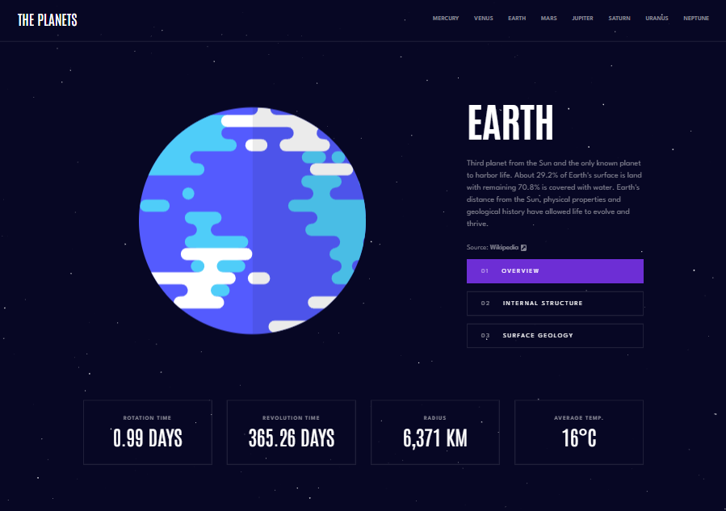
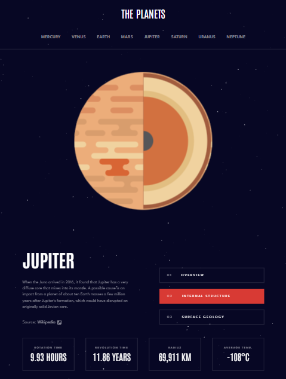
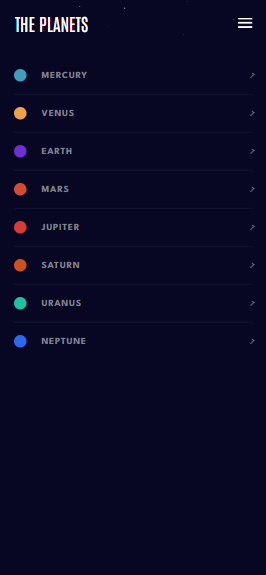
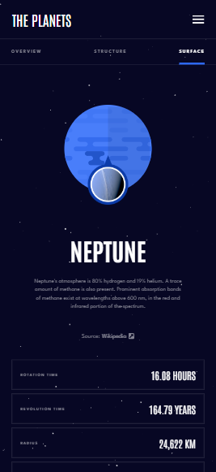

# The Planets

> **Você sabia?** Existe uma **chance de 1 em 2000** de uma estrela cadente cruzar sua tela. Será que você fica tempo suficiente para conseguir fazer um pedido? ;)

## Leia em outros idiomas

- [Português (Brasil)](./docs/README.pt-BR.md)

**The Planets** é uma aplicação web responsiva construída com **React + Vite**, **TypeScript** e **Sass**. Ela oferece uma experiência imersiva pelo nosso sistema solar, com uma estética 2D limpa para exibição dos dados dos planetas, sobre um **background em Canvas** dinâmico e de alta performance.

Veja o projeto rodando aqui:  
[The Planets no Vercel](https://mari-planets.vercel.app/earth)

---

## Funcionalidades

- **Dados Dinâmicos dos Planetas**: Fatos detalhados sobre os 8 planetas, incluindo visão geral, estrutura interna e geologia da superfície.
- **Transições Interativas**: Animações suaves com CSS Keyframes para troca de conteúdo e “soft reveals”.
- **Roteamento Dinâmico**: Implementação de `PlanetRouteWrapper` com `useParams` para renderização dinâmica baseada em dados.
- **Campo de Estrelas com Parallax**: Background em **HTML5 Canvas** com estrelas em diferentes velocidades para criar profundidade, incluindo um sistema raro de estrela cadente (probabilidade: 0,002).
- **Design Responsivo**: Totalmente otimizado para mobile (com menu hamburguer deslizante), tablet e desktop.
- **UI Temática**: Paletas de cores por planeta geradas dinamicamente com Sass maps e loops.

---

## Stack Tecnológico

| Tecnologia          | Função                                              |
| ------------------- | --------------------------------------------------- |
| **React + Vite**    | Estrutura do app e UI                               |
| **TypeScript**      | Lógica e tipagem                                    |
| **Sass (SCSS)**     | Mixins, loops `@each`, tokens e arquitetura modular |
| **CSS Modules**     | Estilização com escopo local e BEM                  |
| **Metodologia BEM** | Organização e manutenção dos estilos                |
| **HTML5 Canvas**    | Starfield dinâmico com efeito Parallax              |
| **Prettier**        | Padronização e formatação de código                 |

---

## Destaques Técnicos

### Parallax & Sistema de Partículas

O background é renderizado com um sistema de partículas customizado em um elemento Canvas. Para criar sensação de profundidade, implementei um **efeito Parallax**, onde estrelas se movem em velocidades diferentes com base no tamanho, criando um falso 3D com alta performance.

### Automação com Sass & BEM

Em vez de codificar manualmente as cores de cada planeta, utilizei um `map` Sass com `@each`. Assim, toda a UI (botões, bullets, bordas) atualiza automaticamente o tema de acordo com os dados do planeta, seguindo a metodologia BEM para escalabilidade e organização.

---

## Como Rodar o Projeto

### Pré-requisitos

- Node.js (>= 14.x)
- npm ou yarn

### Instalação

1. Clone o repositório:
   ```bash
   git clone https://github.com/mari-codes/planets.git
   ```
2. Acesse a pasta:
   ```bash
   cd planets
   ```
3. Instale as dependências:

   ```bash
   npm install
   ```

   ou

   ```bash
   yarn install
   ```

## Executando o Projeto

```sh
npm run dev
```

ou

```bash
yarn dev
```

## Screenshots

---

## Screenshots

### Visão Desktop - Terra (Visão Geral)



### Geologia da Superfície e Visões Responsivas

|                Tablet - Estrutura Interna                |              Mobile - Menu de Navegação              |                  Detalhe de Geologia                   |
| :------------------------------------------------------: | :--------------------------------------------------: | :----------------------------------------------------: |
|  |  |  |
